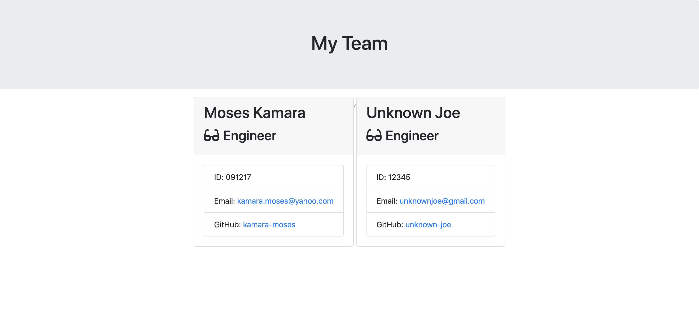

# Team-Profile-Generator

## Badges

## Project Description:
This is a command line application that can be used by a software engineering team. The application will prompt the user for information about the team manager and then information about the team members. The user can input any number of team members, and they may be a mix of engineers and interns. When the user has completed building the team, the application will create an HTML file that displays a nicely formatted team roster based on the information provided by the user.

## Table of Contents
* [Description](#description)
* [Installation](#installation)
* [Usage](#usage)
* [Contributing](#contributing)
* [Test](#test)
* [Questions](#questions)
* [License](#license)
* [Author](#Author)
* [Badges](#badges)
## Installation
To install dependencies, run the following:
`
npm i
`
## Usage
run node app.js
## Contributors
If you would like to contribute to this project please reach out to me on Github or email
## Test
To run tests, run the following:
`
run npm test
`

## Questions
If you have questions about this repository? Please contact me at [kamara.moses@yahoo.com](mailto:kamara.moses@yahoo.com). View more of my work in GitHub at [kamara-moses](https://github.com/kamara-moses).
## License
This repository is licensed under the MIT license.

Copyright (c) [2020] [Moses Kamara]

Permission is hereby granted, free of charge, to any person obtaining a copy of this software and associated documentation files (the 'Software'), to deal in the Software without restriction, including without limitation the rights to use, copy, modify, merge, publish, distribute, sublicense, and/or sell copies of the Software, and to permit persons to whom the Software is furnished to do so, subject to the following conditions:

The above copyright notice and this permission notice shall be included in all copies or substantial portions of the Software.

THE SOFTWARE IS PROVIDED 'AS IS', WITHOUT WARRANTY OF ANY KIND, EXPRESS OR IMPLIED, INCLUDING BUT NOT LIMITED TO THE WARRANTIES OF MERCHANTABILITY, FITNESS FOR A PARTICULAR PURPOSE AND NONINFRINGEMENT. IN NO EVENT SHALL THE AUTHORS OR COPYRIGHT HOLDERS BE LIABLE FOR ANY CLAIM, DAMAGES OR OTHER LIABILITY, WHETHER IN AN ACTION OF CONTRACT, TORT OR OTHERWISE, ARISING FROM, OUT OF OR IN CONNECTION WITH THE SOFTWARE OR THE USE OR OTHER DEALINGS IN THE SOFTWARE.

## Author 

